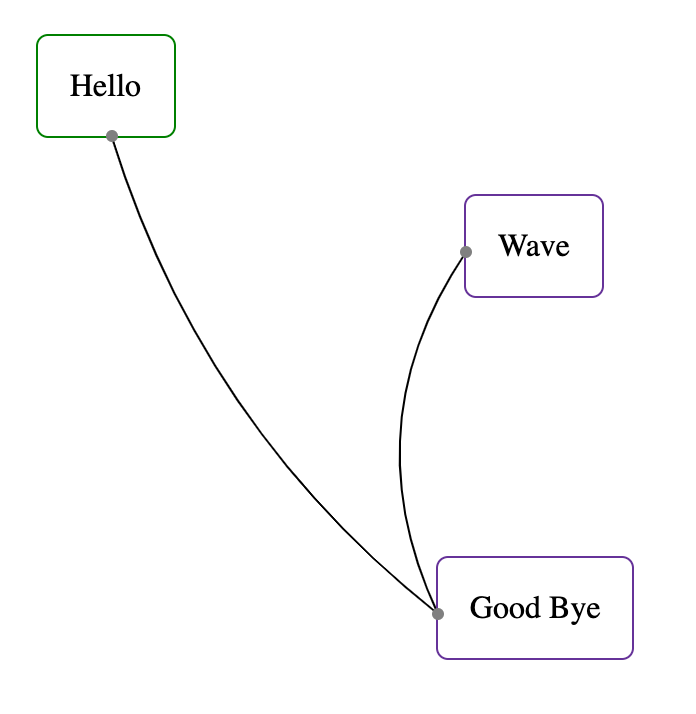

# ember-flow

:construction: Very early, things don't work as intended yet, plus not sure if declarative API will stay or not.

A declarative component based API for building flow charts with nodes and edges.



```hbs
<FlowEditor as |api|>
  <div class='hello-node node {{api.nodeClass}}'>
    Hello
    <div class='handle edge-bottom' {{api.addEdge 'a'}}></div>
  </div>

  <div
    class='bye-node node {{api.nodeClass}}'
    {{style top='150px' left='130px'}}
  >
    Good Bye
    <div class='handle edge-left' {{api.addEdge 'a'}} {{api.addEdge 'b'}}></div>
  </div>

  <div
    class='bye-node node {{api.nodeClass}}'
    {{style top='130px' left='250px'}}
  >
    Wave
    <div class='handle edge-left' {{api.addEdge 'b'}}></div>
  </div>
</FlowEditor>
```

## Compatibility

- Ember.js v3.16 or above
- Ember CLI v2.13 or above
- Node.js v10 or above

## Installation

```
ember install ember-flow
```

## Usage

[Longer description of how to use the addon in apps.]

## Contributing

See the [Contributing](CONTRIBUTING.md) guide for details.

## License

This project is licensed under the [MIT License](LICENSE.md).
