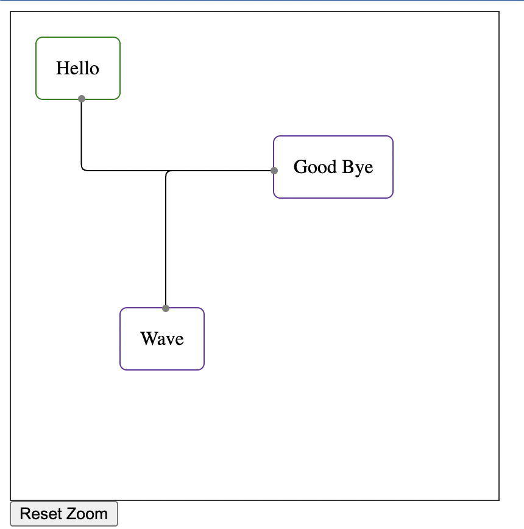

# ember-flow

:construction: Very early, things don't work as intended yet, plus not sure if declarative API will stay or not.

A declarative component based API for building flow charts with nodes and edges.



```hbs
<FlowEditor as |api|>
  {{api.configureEdge 'a' label='Edge A'}}

  <api.Node class='hello-node'>
    <:default>
      Hello
    </:default>

    <:ports as |p|>
      <p.Port @position='bottom' {{p.connectEdge 'a'}}/>
      <p.Port @position='right' {{p.connectEdge 'c'}} />
    </:ports>
  </api.Node>

  <api.Node
    class="bye-node"
    {{style top='150px' left='130px'}}
  >
    <:default>
      Good Bye
    </:default>

    <:ports as |p|>
      <p.Port @position='left' {{p.connectEdge 'a'}} {{p.connectEdge 'b'}}/>
    </:ports>
  </api.Node>

  <api.Node
    class="bye-node"
    {{style top='250px' left='50px'}}
  >
    <:default>
      Wave
    </:default>

    <:ports as |p|>
      <p.Port @position='top' {{p.connectEdge 'b'}}/>
      <p.Port @position='left' {{p.connectEdge 'c'}}/>
    </:ports>
  </api.Node>
</FlowEditor>
```

## Compatibility

- Ember.js v3.16 or above
- Ember CLI v2.13 or above
- Node.js v10 or above

## Installation

```
ember install ember-flow
```

## Usage

[Longer description of how to use the addon in apps.]

## Contributing

See the [Contributing](CONTRIBUTING.md) guide for details.

## License

This project is licensed under the [MIT License](LICENSE.md).
